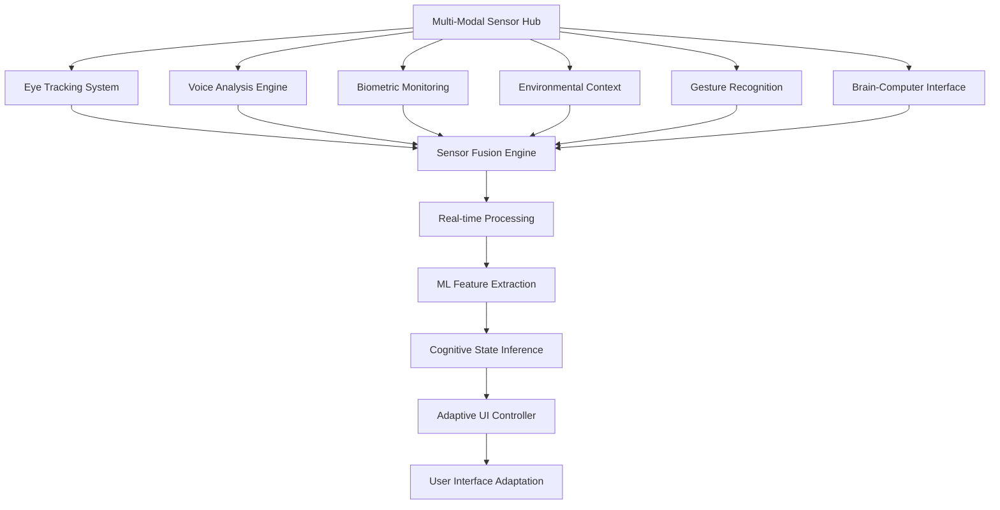

# 🔬 CogUI Advanced Sensor Systems - Technical Architecture

## 🎯 Next-Generation Biometric & Environmental Sensing

### Multi-Modal Sensor Fusion Architecture



## 👁️ Advanced Eye Tracking System

### WebGazer.js Integration & Enhancement
```typescript
interface AdvancedEyeTracker {
  hardwareSupport: {
    webcamBasedTracking: WebGazerConfig;
    tobiiEyeXIntegration: TobiiConfig;
    appleFaceIDLeverage: FaceIDConfig;
    infraredTracking: IRTrackingConfig;
  };
  
  trackingCapabilities: {
    gazePoint: {
      accuracy: '±0.5 degrees';
      precision: '±0.3 degrees';
      frequency: '60-120 Hz';
      latency: '<20ms';
    };
    
    eyeMovements: {
      saccades: SaccadeDetection;
      fixations: FixationAnalysis;
      pursuitMovements: PursuitTracking;
      microsaccades: MicrosaccadeDetection;
    };
    
    pupillometry: {
      pupilDiameter: PupilMeasurement;
      pupilResponse: PupillaryLightReflex;
      cognitiveLoad: CognitiveLoadFromPupil;
      emotionalState: EmotionalStateInference;
    };
  };
  
  calibration: {
    ninePointCalibration: boolean;
    adaptiveRecalibration: boolean;
    headMovementCompensation: boolean;
    lightingAdaptation: boolean;
  };
}
```

### Gaze-Based Interaction Patterns
```typescript
interface GazeInteractionEngine {
  dwellTimeClicking: {
    enabled: boolean;
    dwellThreshold: number; // milliseconds
    confirmationFeedback: FeedbackType;
    cancelationGesture: GestureType;
  };
  
  gazeGuidedNavigation: {
    smoothScrolling: boolean;
    gazeTrail: VisualTrail;
    predictiveLoading: boolean;
    contextualZooming: boolean;
  };
  
  attentionAwareness: {
    readingPatternAnalysis: ReadingPattern;
    comprehensionTracking: ComprehensionMetrics;
    cognitiveLoadDetection: LoadDetectionAlgorithm;
    distractionAlert: AlertSystem;
  };
  
  accessibilityFeatures: {
    eyeOnlyNavigation: boolean;
    blinkBasedInput: BlinkDetection;
    gazeKeyboard: VirtualKeyboard;
    eyeGestureCommands: GestureCommandSet;
  };
}
```

### Eye Movement Analysis & Insights
```typescript
interface EyeMovementAnalytics {
  readingBehavior: {
    scanPathAnalysis: ScanPathMetrics;
    fixationDistribution: FixationMap;
    regressionAnalysis: RegressionPattern;
    readingSpeed: ReadingVelocity;
  };
  
  visualAttention: {
    attentionHeatmap: HeatmapGeneration;
    areaOfInterestAnalysis: AOIAnalysis;
    visualSearchEfficiency: SearchMetrics;
    salieneyMapping: SaliencyModel;
  };
  
  cognitiveMetrics: {
    mentalWorkload: WorkloadEstimation;
    fatigue: FatigueDetection;
    stress: StressIndicators;
    engagement: EngagementLevel;
  };
}
```

## 🎤 Voice Analysis & Speech Processing

### Advanced Speech Analytics Engine
```typescript
interface VoiceAnalysisSystem {
  speechRecognition: {
    multiLanguageSupport: LanguageModel[];
    noiseReduction: NoiseSuppressionAlgorithm;
    speakerAdaptation: SpeakerModel;
    contextualUnderstanding: NLUEngine;
  };
  
  acousticAnalysis: {
    fundamentalFrequency: F0Analysis;
    speechRate: TempoAnalysis;
    pausePatterns: PauseDetection;
    articulation: ArticulationQuality;
  };
  
  emotionalAnalysis: {
    emotionRecognition: EmotionClassifier;
    stressDetection: StressAnalyzer;
    fatigueIndicators: FatigueFromVoice;
    cognitiveLoadMetrics: CognitiveLoadFromSpeech;
  };
  
  accessibilityFeatures: {
    voiceCommands: VoiceCommandProcessor;
    speechToText: STTEngine;
    textToSpeech: TTSEngine;
    voicePersonalization: VoicePersonalizer;
  };
}
```

### Real-time Speech Processing Pipeline
```typescript
interface SpeechProcessingPipeline {
  audioCapture: {
    sampleRate: 16000 | 44100; // Hz
    bitDepth: 16 | 24;
    channels: 'mono' | 'stereo';
    bufferSize: 1024 | 2048 | 4096;
  };
  
  preprocessing: {
    noiseGating: NoiseGateConfig;
    normalization: AudioNormalization;
    windowing: WindowFunction;
    featureExtraction: AcousticFeatures;
  };
  
  analysis: {
    realTimeProcessing: boolean;
    batchProcessing: boolean;
    streamingAnalysis: boolean;
    edgeComputing: boolean;
  };
  
  privacy: {
    localProcessing: boolean;
    dataEncryption: boolean;
    automaticDeletion: boolean;
    consentManagement: boolean;
  };
}
```

## ❤️ Biometric Monitoring Integration

### Multi-Sensor Biometric Platform
```typescript
interface BiometricSensorSuite {
  heartRateMonitoring: {
    sources: ('webcam-ppg' | 'wearable' | 'chest-strap' | 'finger-sensor')[];
    metrics: {
      heartRate: HeartRateData;
      heartRateVariability: HRVAnalysis;
      stressIndex: StressMetrics;
      recovery: RecoveryMetrics;
    };
  };
  
  skinConductance: {
    galvanicSkinResponse: GSRSensor;
    emotionalArousal: ArousalDetection;
    stressResponse: StressResponse;
    engagementLevel: EngagementMetrics;
  };
  
  respirationTracking: {
    breathingRate: RespirationRate;
    breathingPattern: BreathingPatternAnalysis;
    relaxationState: RelaxationMetrics;
    anxietyDetection: AnxietyIndicators;
  };
  
  bodyTemperature: {
    surfaceTemperature: ThermalSensing;
    temperatureVariability: TempVariationAnalysis;
    thermalComfort: ComfortMetrics;
    stressCorrelation: ThermalStressAnalysis;
  };
}
```

### Wearable Device Integration
```typescript
interface WearableIntegration {
  supportedDevices: {
    appleWatch: AppleHealthKitIntegration;
    fitbitDevices: FitbitWebAPIIntegration;
    garminWatches: GarminConnectIQIntegration;
    wearOS: WearOSIntegration;
    ouraRing: OuraAPIIntegration;
  };
  
  dataTypes: {
    heartRate: ContinuousHRData;
    activityLevel: ActivityMetrics;
    sleepQuality: SleepAnalysis;
    stressLevels: StressTracking;
    location: LocationContext;
  };
  
  privacyControls: {
    dataMinimization: boolean;
    localProcessing: boolean;
    userConsent: ConsentManagement;
    dataRetention: RetentionPolicy;
  };
}
```

## 🌍 Environmental Context Sensing

### Smart Environment Awareness
```typescript
interface EnvironmentalSensing {
  ambientLighting: {
    lightLevel: LuxMeter;
    colorTemperature: ColorTemperatureAnalysis;
    flickerDetection: FlickerAnalysis;
    circadianAlignment: CircadianLightingOptimization;
  };
  
  acousticEnvironment: {
    noiseLevel: DecibelMeasurement;
    noiseType: NoiseClassification;
    speechIntelligibility: SpeechClarityIndex;
    acousticComfort: ComfortAssessment;
  };
  
  airQuality: {
    particulateMatter: PMSensor;
    co2Levels: CO2Monitoring;
    humidity: HumidityTracking;
    temperature: TemperatureMonitoring;
  };
  
  deviceContext: {
    screenBrightness: BrightnessControl;
    batteryLevel: PowerManagement;
    networkQuality: ConnectionQuality;
    processingLoad: SystemPerformance;
  };
}
```

### Location & Context Intelligence
```typescript
interface ContextualIntelligence {
  locationAwareness: {
    indoorPositioning: IndoorLocationSystem;
    activityRecognition: ActivityClassifier;
    environmentType: EnvironmentClassification;
    socialContext: SocialSituationDetection;
  };
  
  temporalContext: {
    timeOfDay: TemporalPatterns;
    dayOfWeek: WeeklyPatterns;
    seasonality: SeasonalAdjustments;
    personalSchedule: CalendarIntegration;
  };
  
  workflowContext: {
    taskType: TaskClassification;
    urgencyLevel: UrgencyDetection;
    concentrationRequirements: ConcentrationNeeds;
    collaborationMode: CollaborationDetection;
  };
}
```

## 🤚 Advanced Gesture Recognition

### Multi-Modal Gesture System
```typescript
interface GestureRecognitionEngine {
  handTracking: {
    mediapieeIntegration: MediaPipeHands;
    leapMotionSupport: LeapMotionAPI;
    depthCameraSupport: DepthCameraInterface;
    markerlessTracking: MarkerlessHandTracking;
  };
  
  gestureTypes: {
    staticGestures: StaticGestureClassifier;
    dynamicGestures: DynamicGestureRecognition;
    airTapping: AirTapDetection;
    pinchGestures: PinchGestureAnalysis;
    swipeMotions: SwipeGestureTracking;
  };
  
  applications: {
    navigationControl: GestureNavigation;
    contentManipulation: ContentGestures;
    accessibilityCommands: A11yGestures;
    presentationControl: PresentationGestures;
  };
  
  calibration: {
    personalizedGestures: PersonalGestureTraining;
    gestureAdaptation: GestureModelAdaptation;
    errorCorrection: GestureErrorHandling;
    confidenceThresholds: ConfidenceManagement;
  };
}
```

## 🧠 Brain-Computer Interface (BCI) Integration

### EEG-Based Cognitive Monitoring
```typescript
interface BCIIntegration {
  eegDevices: {
    emotivEPOC: EmotivEPOCInterface;
    museBandwidth: MuseHeadbandAPI;
    openBCISupport: OpenBCIProtocol;
    neuroskyThinkGear: ThinkGearAPI;
  };
  
  brainSignalAnalysis: {
    attentionLevel: AttentionFromEEG;
    meditationState: MeditationDetection;
    cognitiveWorkload: CognitiveLoadFromEEG;
    emotionalState: EmotionFromBrainwaves;
  };
  
  applications: {
    mentalStateAdaptation: MentalStateUI;
    concentrationEnhancement: FocusOptimization;
    stressReduction: StressManagement;
    neurofeedback: RealTimeNeurofeedback;
  };
  
  privacy: {
    brainDataProtection: BrainPrivacyProtocol;
    neurologicalPrivacy: NeuroPrivacyStandards;
    consentFramework: BCIConsentManagement;
    dataMinimization: MinimalBrainData;
  };
}
```

## 📡 Sensor Fusion & Data Integration

### Multi-Sensor Data Fusion Framework
```typescript
interface SensorFusionEngine {
  fusionAlgorithms: {
    kalmanFiltering: KalmanFilter;
    particleFiltering: ParticleFilter;
    bayesianFusion: BayesianInference;
    deepLearningFusion: NeuralNetworkFusion;
  };
  
  dataAlignment: {
    temporalSynchronization: TimeSync;
    spatialRegistration: SpatialAlignment;
    featureAlignment: FeatureMatching;
    modalityAlignment: CrossModalAlignment;
  };
  
  qualityAssurance: {
    dataValidation: SensorDataValidation;
    outlierDetection: AnomalyDetection;
    confidenceScoring: ConfidenceMetrics;
    uncertaintyQuantification: UncertaintyEstimation;
  };
  
  realTimeProcessing: {
    streamProcessing: StreamingAnalytics;
    edgeComputing: EdgeProcessingNodes;
    cloudIntegration: CloudAnalytics;
    hybridProcessing: HybridArchitecture;
  };
}
```

### Predictive Sensor Analytics
```typescript
interface PredictiveSensorAnalytics {
  behaviorPrediction: {
    shortTermPrediction: '1-60 seconds';
    mediumTermPrediction: '1-60 minutes';
    longTermPrediction: '1-24 hours';
    trendAnalysis: 'weekly patterns';
  };
  
  anomalyPrediction: {
    healthAnomalies: HealthAnomalyDetection;
    behaviorAnomalies: BehaviorAnomalyDetection;
    performanceAnomalies: PerformanceAnomalyDetection;
    environmentalAnomalies: EnvironmentalAnomalyDetection;
  };
  
  interventionTiming: {
    optimalInterventionPoints: InterventionOptimization;
    preventiveActions: PreventiveActionScheduling;
    adaptiveRecommendations: AdaptiveRecommendationEngine;
    proactiveSupport: ProactiveSupportSystem;
  };
}
```

## 🔒 Privacy & Security Framework

### Privacy-Preserving Sensor Data
```typescript
interface SensorPrivacy {
  dataProtection: {
    onDeviceProcessing: LocalProcessingEngine;
    differentialPrivacy: DifferentialPrivacyProtocol;
    homomorphicEncryption: HomomorphicEncryptionLayer;
    federatedLearning: FederatedLearningFramework;
  };
  
  consentManagement: {
    granularConsent: PerSensorConsent;
    dynamicConsent: ConsentManagement;
    rightToForget: DataDeletion;
    dataPortability: DataExportFeatures;
  };
  
  securityMeasures: {
    endToEndEncryption: E2EEncryption;
    secureMultipartyComputation: SMCProtocols;
    zeroKnowledgeProofs: ZKProofSystem;
    biometricTemplateProtection: BiometricProtection;
  };
}
```

## 🎯 Use Case Implementations

### Healthcare & Wellness Applications
```typescript
interface HealthcareUseCases {
  cognitiveHealthMonitoring: {
    attentionDisorderTracking: ADHDMonitoring;
    memoryAssessment: MemoryTestingInterface;
    cognitiveDeclineDetection: CognitiveDeclineAlerts;
    rehabilitationSupport: CognitiveRehab;
  };
  
  stressManagement: {
    realTimeStressDetection: StressMonitoring;
    interventionRecommendations: StressInterventions;
    relaxationGuidance: RelaxationProtocols;
    biofeedbackTraining: BiofeedbackSessions;
  };
  
  accessibilitySupport: {
    assistiveTechnology: AssistiveTechIntegration;
    adaptiveInterfaces: AccessibilityAdaptations;
    communicationAids: CommunicationSupport;
    independentLiving: IndependentLivingSupport;
  };
}
```

### Educational Technology Applications
```typescript
interface EducationalUseCases {
  learningAnalytics: {
    attentionTracking: LearningAttentionAnalysis;
    comprehensionAssessment: ComprehensionMetrics;
    engagementMeasurement: StudentEngagement;
    personalizedPacing: AdaptivePacing;
  };
  
  specialEducation: {
    learningDisabilitySupport: LearningDisabilityAdaptations;
    autismSpectrumSupport: AutismFriendlyInterfaces;
    adhdAccommodations: ADHDSupportFeatures;
    sensoryProcessingSupport: SensoryAdaptations;
  };
  
  performanceOptimization: {
    optimalLearningTimes: ChronotypOptimization;
    cognitiveLoadManagement: LoadBalancing;
    fatigueManagement: FatiguePreventionStrategies;
    motivationEnhancement: MotivationSystems;
  };
}
```

---

**🔬 CogUI Advanced Sensors**: İnsan-bilgisayar etkileşiminde yeni çağ! 🚀🧠