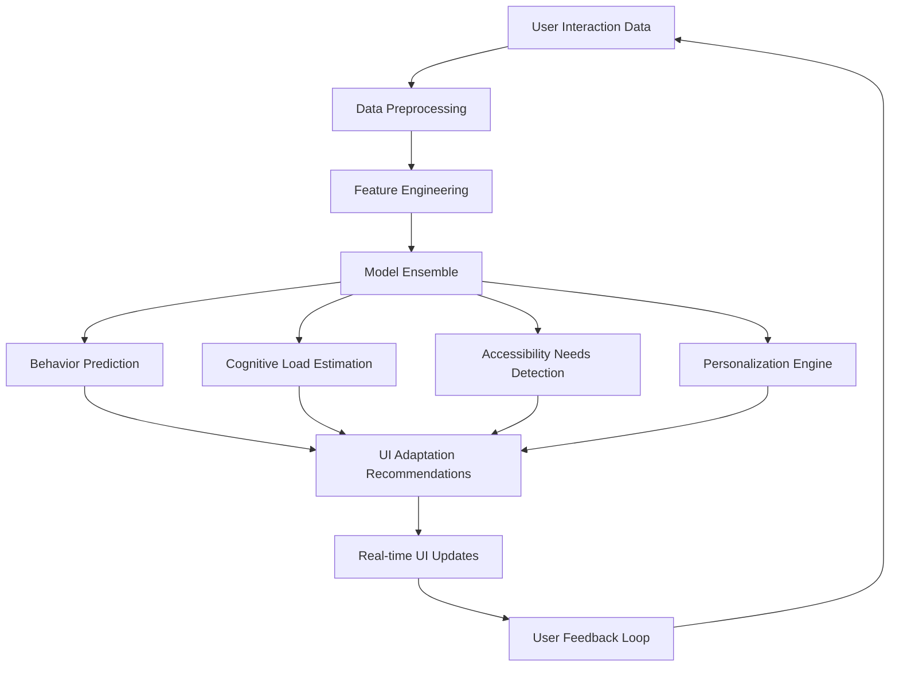

# 🤖 CogUI AI/ML Integration - Technical Specifications

## 🧠 AI-Powered Cognitive Analysis Engine

### Core AI Architecture



## 🔬 Machine Learning Models

### 1. Cognitive Load Prediction Model
```typescript
interface CognitiveLoadModel {
  architecture: 'LSTM + Attention';
  inputFeatures: {
    mouseMetrics: MouseTrackingData;
    eyeGazePattern: EyeTrackingData;
    heartRateVariability: BiometricData;
    taskContext: ContextualData;
    timeOfDay: number;
    sessionDuration: number;
  };
  
  outputPrediction: {
    cognitiveLoadLevel: 0-1; // 0=low, 1=high
    confidenceScore: 0-1;
    recommendedAdaptations: AdaptationType[];
    timeToFatigue: number; // minutes
  };
}
```

**Model Training Pipeline:**
```python
# TensorFlow.js Model Architecture
import tensorflow as tf

class CognitiveLoadPredictor:
    def __init__(self):
        self.model = tf.keras.Sequential([
            tf.keras.layers.LSTM(128, return_sequences=True, input_shape=(sequence_length, feature_count)),
            tf.keras.layers.Attention(),
            tf.keras.layers.LSTM(64, return_sequences=False),
            tf.keras.layers.Dense(32, activation='relu'),
            tf.keras.layers.Dropout(0.3),
            tf.keras.layers.Dense(1, activation='sigmoid')  # Cognitive load score
        ])
    
    def predict_cognitive_load(self, user_data):
        processed_features = self.preprocess_features(user_data)
        prediction = self.model.predict(processed_features)
        return {
            'cognitive_load': prediction[0],
            'confidence': self.calculate_confidence(processed_features),
            'adaptations': self.suggest_adaptations(prediction[0])
        }
```

### 2. Behavior Prediction Engine
```typescript
interface BehaviorPredictionModel {
  modelType: 'Transformer + Graph Neural Network';
  
  capabilities: {
    predictNextAction: (history: UserAction[]) => ActionPrediction;
    estimateTaskCompletion: (currentState: UIState) => CompletionPrediction;
    detectUsabilityIssues: (interactionPattern: InteractionSequence) => UsabilityIssue[];
    personalizeInterface: (userProfile: UserProfile) => UIConfiguration;
  };
  
  realTimeFeatures: {
    clickPrediction: boolean;
    scrollAnticipation: boolean;
    errorPrevention: boolean;
    contextualHelp: boolean;
  };
}
```

### 3. Accessibility Needs Classification
```typescript
interface AccessibilityClassifier {
  neuralArchitecture: 'Multi-task CNN + BERT';
  
  classificationTargets: {
    motorImpairments: 'none' | 'mild' | 'moderate' | 'severe';
    visualImpairments: 'none' | 'low-vision' | 'color-blind' | 'blind';
    cognitiveImpairments: 'none' | 'attention' | 'memory' | 'processing';
    auditoryImpairments: 'none' | 'hard-of-hearing' | 'deaf';
    temporaryDisabilities: 'none' | 'fatigue' | 'stress' | 'distraction';
  };
  
  adaptationMapping: {
    [key in keyof classificationTargets]: AdaptationStrategy[];
  };
}
```

## 🧮 Advanced Analytics & Insights

### User Journey Intelligence
```typescript
interface JourneyAnalytics {
  pathOptimization: {
    identifyBottlenecks: (userFlows: UserFlow[]) => Bottleneck[];
    suggestImprovements: (bottlenecks: Bottleneck[]) => Improvement[];
    predictDropoffPoints: (currentPath: NavigationPath) => DropoffRisk[];
  };
  
  cognitiveFlowMapping: {
    attentionHeatmaps: AttentionMap[];
    cognitiveLoadJourney: CognitiveLoadPoint[];
    fatigueAccumulation: FatiguePattern;
    recoveryPoints: RecoveryOpportunity[];
  };
}
```

### Anomaly Detection System
```typescript
interface AnomalyDetectionEngine {
  algorithms: {
    isolationForest: boolean;
    autoencoders: boolean;
    oneClassSVM: boolean;
    statisticalTests: boolean;
  };
  
  anomalyTypes: {
    behavioralAnomalies: UserBehaviorAnomaly[];
    performanceAnomalies: SystemPerformanceAnomaly[];
    accessibilityBarriers: AccessibilityAnomaly[];
    cognitiveOverload: CognitiveOverloadEvent[];
  };
  
  responseStrategies: {
    [anomalyType: string]: ResponseStrategy;
  };
}
```

## 🔄 Real-time Learning & Adaptation

### Online Learning Pipeline
```typescript
interface OnlineLearningSystem {
  continuousLearning: {
    modelUpdates: 'incremental' | 'periodic' | 'triggered';
    feedbackIntegration: 'immediate' | 'batch' | 'hybrid';
    performanceMonitoring: 'real-time' | 'scheduled';
  };
  
  adaptationStrategies: {
    personalizedModels: boolean;
    contextualAdaptation: boolean;
    collaborativeFiltering: boolean;
    transferLearning: boolean;
  };
  
  dataRetention: {
    rawDataLifecycle: 'session' | 'user' | 'global';
    modelVersioning: boolean;
    privacyCompliance: 'GDPR' | 'CCPA' | 'HIPAA';
  };
}
```

### Reinforcement Learning for UI Optimization
```typescript
interface RLOptimizationAgent {
  environment: {
    state: UIState;
    actions: UIAction[];
    rewards: UserSatisfactionMetrics;
    terminal: TaskCompletionStatus;
  };
  
  agent: {
    algorithm: 'PPO' | 'SAC' | 'DQN';
    neuralNetwork: 'Actor-Critic' | 'Q-Network';
    explorationStrategy: 'epsilon-greedy' | 'UCB' | 'Thompson-sampling';
  };
  
  objectives: {
    maximizeTaskCompletion: boolean;
    minimizeCognitiveLoad: boolean;
    improveAccessibility: boolean;
    reduceErrorRate: boolean;
  };
}
```

## 🎯 Personalization Engine

### User Profile Modeling
```typescript
interface CognitiveUserProfile {
  demographics: {
    ageRange: string;
    techProficiency: 'novice' | 'intermediate' | 'expert';
    domainExpertise: string[];
  };
  
  cognitiveCharacteristics: {
    workingMemoryCapacity: number; // 0-1
    attentionSpan: number; // minutes
    processingSpeed: number; // 0-1
    visualProcessingPreference: number; // 0-1
    auditoryProcessingPreference: number; // 0-1
  };
  
  accessibilityNeeds: {
    permanentDisabilities: Disability[];
    temporaryImpairments: TemporaryImpairment[];
    situationalLimitations: SituationalContext[];
  };
  
  behaviorPatterns: {
    interactionStyle: 'methodical' | 'exploratory' | 'goal-oriented';
    errorRecoveryStrategy: 'systematic' | 'trial-and-error' | 'help-seeking';
    feedbackPreference: 'immediate' | 'summary' | 'minimal';
  };
}
```

### Dynamic Personalization
```typescript
interface PersonalizationEngine {
  realTimeAdaptation: {
    contextualAwareness: {
      timeOfDay: boolean;
      deviceType: boolean;
      environmentalFactors: boolean;
      taskUrgency: boolean;
    };
    
    adaptationTypes: {
      layoutSimplification: boolean;
      colorSchemeAdjustment: boolean;
      fontSizeOptimization: boolean;
      interactionModalitySelection: boolean;
      contentPrioritization: boolean;
    };
  };
  
  learningMechanisms: {
    implicitFeedback: UserInteractionAnalysis;
    explicitFeedback: UserRatingSystem;
    contextualBandits: ContextualOptimization;
    multiArmedBandits: FeatureSelection;
  };
}
```

## 🔮 Predictive Analytics

### Future State Prediction
```typescript
interface FutureStatePredictor {
  predictionHorizons: {
    immediate: '1-5 seconds';
    shortTerm: '1-30 minutes';
    mediumTerm: '1-24 hours';
    longTerm: '1-30 days';
  };
  
  predictionTypes: {
    cognitiveLoadTrajectory: CognitiveLoadForecast;
    taskCompletionLikelihood: CompletionProbability;
    errorPronePeriods: ErrorRiskForecast;
    optimalInteractionTimes: OptimalTimingForecast;
  };
  
  applications: {
    proactiveAdaptation: boolean;
    preventiveInterventions: boolean;
    resourceOptimization: boolean;
    userGuidance: boolean;
  };
}
```

### Cohort Analysis & Insights
```typescript
interface CohortAnalytics {
  segmentation: {
    cognitiveProfiles: CognitiveSegment[];
    accessibilityNeeds: AccessibilitySegment[];
    usagePattterns: BehaviorSegment[];
    performanceMetrics: PerformanceSegment[];
  };
  
  insights: {
    segmentComparisons: SegmentComparison[];
    bestPractices: BestPracticeRecommendation[];
    designOpportunities: DesignOpportunity[];
    accessibilityGaps: AccessibilityGap[];
  };
  
  recommendations: {
    personalizedExperiences: PersonalizationStrategy[];
    universalImprovements: UniversalDesignChange[];
    targetedFeatures: FeatureRequest[];
    trainingNeeds: TrainingRecommendation[];
  };
}
```

## ⚡ Performance & Optimization

### Model Optimization Strategies
```typescript
interface ModelOptimization {
  techniques: {
    quantization: '8-bit' | '16-bit' | 'dynamic';
    pruning: 'structured' | 'unstructured' | 'gradual';
    distillation: 'teacher-student' | 'self-distillation';
    caching: 'prediction-cache' | 'feature-cache' | 'model-cache';
  };
  
  deploymentOptimization: {
    webAssembly: boolean;
    webWorkers: boolean;
    serviceWorkers: boolean;
    edgeComputing: boolean;
  };
  
  performanceTargets: {
    predictionLatency: '<50ms';
    modelSize: '<10MB';
    memoryUsage: '<100MB';
    cpuUtilization: '<20%';
  };
}
```

### Federated Learning Architecture
```typescript
interface FederatedLearning {
  architecture: {
    centralServer: ModelAggregationServer;
    clientNodes: ClientDevice[];
    communicationProtocol: 'FedAvg' | 'FedProx' | 'SCAFFOLD';
  };
  
  privacyPreservation: {
    differentialPrivacy: boolean;
    homomorphicEncryption: boolean;
    secureAggregation: boolean;
    localDataOnly: boolean;
  };
  
  advantages: {
    userPrivacy: 'Data never leaves device';
    personalization: 'Individual model adaptation';
    scalability: 'Distributed computing';
    compliance: 'GDPR/HIPAA friendly';
  };
}
```

## 📊 Evaluation & Validation

### Model Performance Metrics
```typescript
interface ModelEvaluationMetrics {
  accuracyMetrics: {
    cognitiveLoadPrediction: {
      mse: number;
      mae: number;
      r2Score: number;
    };
    
    behaviorPrediction: {
      precision: number;
      recall: number;
      f1Score: number;
      auc: number;
    };
    
    accessibilityClassification: {
      balancedAccuracy: number;
      cohensKappa: number;
      confusionMatrix: ConfusionMatrix;
    };
  };
  
  businessMetrics: {
    userSatisfactionImprovement: number;
    taskCompletionRateIncrease: number;
    errorReduction: number;
    accessibilityComplianceScore: number;
  };
  
  realTimePerformance: {
    predictionLatency: number;
    throughput: number;
    memoryEfficiency: number;
    energyConsumption: number;
  };
}
```

### A/B Testing Framework
```typescript
interface AIModelABTesting {
  experimentDesign: {
    controlGroup: 'static-ui' | 'rule-based' | 'previous-model';
    treatmentGroups: AIModelVariant[];
    randomizationStrategy: 'user-level' | 'session-level' | 'interaction-level';
    sampleSizeCalculation: StatisticalPowerAnalysis;
  };
  
  successMetrics: {
    primary: UserExperienceMetric[];
    secondary: TechnicalPerformanceMetric[];
    guardrail: SafetyMetric[];
  };
  
  analysisFramework: {
    statisticalTests: StatisticalTest[];
    effectSizeCalculation: EffectSizeMethod;
    significanceThreshold: number;
    minimumDetectableEffect: number;
  };
}
```

## 🔒 Ethical AI & Responsible Development

### Bias Detection & Mitigation
```typescript
interface BiasDetectionSystem {
  biasTypes: {
    demographic: DemographicBias;
    cognitive: CognitiveBias;
    accessibility: AccessibilityBias;
    cultural: CulturalBias;
  };
  
  detectionMethods: {
    statisticalParity: boolean;
    equalizedOdds: boolean;
    demographicParity: boolean;
    individualFairness: boolean;
  };
  
  mitigationStrategies: {
    dataAugmentation: boolean;
    algorithmicFairness: boolean;
    postProcessingCorrection: boolean;
    diverseTeamReview: boolean;
  };
}
```

### Explainable AI (XAI)
```typescript
interface ExplainableAI {
  explanationTypes: {
    globalExplanations: ModelInterpretation;
    localExplanations: PredictionExplanation;
    counterfactualExplanations: CounterfactualAnalysis;
    exampleBasedExplanations: SimilarCaseAnalysis;
  };
  
  explanationMethods: {
    shap: 'SHapley Additive exPlanations';
    lime: 'Local Interpretable Model-agnostic Explanations';
    gradcam: 'Gradient-weighted Class Activation Mapping';
    integratedGradients: 'Attribution method for neural networks';
  };
  
  userFacingExplanations: {
    simplifiedLanguage: boolean;
    visualExplanations: boolean;
    interactiveExploration: boolean;
    confidenceIndicators: boolean;
  };
}
```

---

**🚀 CogUI AI/ML Integration**: Kullanıcı deneyiminde yapay zeka devrimi! 🤖✨