# 🖥️ CogUI Backend Infrastructure - Cloud-Native Architecture

## 🏗️ Microservices Architecture Overview

### Cloud-Native Enterprise Backend

```mermaid
graph TD
    A[API Gateway] --> B[Authentication Service]
    A --> C[User Management Service]
    A --> D[Analytics Service]
    A --> E[AI/ML Service]
    A --> F[Sensor Data Service]
    A --> G[Plugin Service]
    A --> H[Notification Service]
    
    B --> I[(Auth Database)]
    C --> J[(User Database)]
    D --> K[(Analytics Database)]
    E --> L[(ML Models Storage)]
    F --> M[(Time-Series DB)]
    G --> N[(Plugin Registry)]
    H --> O[(Message Queue)]
    
    P[WebSocket Gateway] --> Q[Real-time Engine]
    P --> R[Live Analytics]
    P --> S[Collaborative Features]
    
    T[CDN] --> U[Static Assets]
    T --> V[Plugin Distribution]
    T --> W[Media Storage]
    
    X[Cache Layer] --> Y[Redis Cluster]
    X --> Z[Memory Cache]
    
    AA[Monitoring] --> BB[Prometheus]
    AA --> CC[Grafana]
    AA --> DD[ELK Stack]
```



## ⚡ Real-time Data Processing Pipeline

### Event-Driven Architecture
```typescript
interface EventDrivenArchitecture {
  eventSources: {
    userInteractions: UserInteractionEvents;
    sensorData: SensorDataStream;
    aiPredictions: AIPredictionEvents;
    systemMetrics: SystemMetricEvents;
  };
  
  eventProcessing: {
    eventBus: EventBusConfiguration;
    streamProcessing: StreamProcessingPipeline;
    eventSourcing: EventSourcingPattern;
    cqrs: CQRSImplementation;
  };
  
  realTimeUpdates: {
    webSocketConnections: WebSocketManager;
    serverSentEvents: SSEManager;
    pushNotifications: PushNotificationService;
    liveUpdates: LiveUpdateEngine;
  };
}
```

### High-Performance Stream Processing
```typescript
interface StreamProcessingPipeline {
  ingestion: {
    kafkaStreams: KafkaConfiguration;
    apacheBeam: BeamPipelineConfig;
    apacheFlink: FlinkJobConfiguration;
    awsKinesis: KinesisStreamConfig;
  };
  
  processing: {
    realTimeAnalytics: RealTimeAnalyticsEngine;
    anomalyDetection: AnomalyDetectionPipeline;
    patternRecognition: PatternRecognitionEngine;
    predictiveAnalytics: PredictiveAnalyticsPipeline;
  };
  
  storage: {
    timeSeries: TimeSeriesDatabase;
    eventStore: EventStoreConfiguration;
    dataLake: DataLakeArchitecture;
    analyticsWarehouse: AnalyticsWarehouse;
  };
}
```

## 🔐 Authentication & Authorization Framework

### Zero-Trust Security Model
```typescript
interface ZeroTrustSecurityFramework {
  authentication: {
    multiFactorAuth: MFAConfiguration;
    biometricAuth: BiometricAuthProvider;
    ssoIntegration: SSOProviderConfig;
    passwordlessAuth: PasswordlessAuthConfig;
  };
  
  authorization: {
    rbacSystem: RBACConfiguration;
    abacSystem: ABACConfiguration;
    opaIntegration: OPAPolicyEngine;
    finegrainedPermissions: PermissionMatrix;
  };
  
  tokenManagement: {
    jwtTokens: JWTConfiguration;
    refreshTokens: RefreshTokenStrategy;
    tokenRevocation: TokenRevocationService;
    tokenEncryption: TokenEncryptionConfig;
  };
  
  securityPolicies: {
    passwordPolicies: PasswordPolicyEngine;
    sessionManagement: SessionManager;
    deviceTrust: DeviceTrustFramework;
    locationBasedSecurity: LocationSecurityRules;
  };
}
```

### Enterprise SSO Integration
```typescript
interface EnterpriseSSOIntegration {
  providers: {
    activeDirectory: ADIntegration;
    azureAD: AzureADConfig;
    okta: OktaIntegration;
    auth0: Auth0Configuration;
    googleWorkspace: GoogleWorkspaceSSO;
    oneLogin: OneLoginIntegration;
  };
  
  protocols: {
    saml2: SAML2Configuration;
    oauth2: OAuth2FlowConfig;
    openIdConnect: OIDCConfiguration;
    ldapIntegration: LDAPConfig;
  };
  
  userProvisioning: {
    justInTimeProvisioning: JITProvisioning;
    scimProtocol: SCIMIntegration;
    userSynchronization: UserSyncService;
    groupMapping: GroupMappingRules;
  };
}
```

## 📊 Analytics & Data Warehouse Architecture

### Advanced Analytics Platform
```typescript
interface AnalyticsPlatform {
  dataIngestion: {
    batchProcessing: BatchProcessingJobs;
    streamingIngestion: StreamIngestionPipeline;
    etlPipelines: ETLConfiguration;
    dataValidation: DataValidationRules;
  };
  
  dataStorage: {
    dataWarehouse: DataWarehouseSchema;
    dataLake: DataLakeArchitecture;
    timeSeries: TimeSeriesStorage;
    searchIndex: ElasticsearchConfig;
  };
  
  analyticsEngine: {
    realTimeAnalytics: RealTimeAnalyticsEngine;
    batchAnalytics: BatchAnalyticsJobs;
    mlPipelines: MLPipelineOrchestration;
    reportGeneration: ReportGenerationService;
  };
  
  dataVisualization: {
    dashboardEngine: DashboardService;
    customReports: ReportBuilder;
    dataExploration: DataExplorationTools;
    embeddedAnalytics: EmbeddedAnalyticsSDK;
  };
}
```

### Big Data Processing Framework
```typescript
interface BigDataProcessingFramework {
  distributedComputing: {
    apacheSpark: SparkClusterConfig;
    hadoopEcosystem: HadoopConfiguration;
    kubernetesJobs: K8sJobConfiguration;
    serverlessComputing: ServerlessComputeConfig;
  };
  
  dataProcessing: {
    batchProcessing: BatchJobOrchestration;
    streamProcessing: StreamProcessingFramework;
    graphProcessing: GraphProcessingEngine;
    mlTrainingPipelines: MLTrainingOrchestration;
  };
  
  storageOptimization: {
    dataPartitioning: PartitioningStrategy;
    dataCompression: CompressionAlgorithms;
    indexingStrategy: IndexOptimization;
    cachingLayers: CacheOptimization;
  };
}
```

## 🤖 AI/ML Infrastructure & MLOps

### ML Model Lifecycle Management
```typescript
interface MLOpsInfrastructure {
  modelDevelopment: {
    jupyterHubCluster: JupyterHubConfig;
    mlflowTracking: MLFlowConfiguration;
    experimentTracking: ExperimentTrackingSystem;
    dataVersioning: DataVersionControl;
  };
  
  modelTraining: {
    distributedTraining: DistributedTrainingCluster;
    gpuAcceleration: GPUClusterManagement;
    hyperparameterTuning: HyperparameterOptimization;
    autoMLPipelines: AutoMLConfiguration;
  };
  
  modelDeployment: {
    modelServing: ModelServingPlatform;
    canaryDeployments: CanaryDeploymentStrategy;
    a/bTesting: ABTestingFramework;
    modelVersioning: ModelVersionManagement;
  };
  
  monitoring: {
    modelPerformance: ModelPerformanceMonitoring;
    datadrift: DataDriftDetection;
    conceptDrift: ConceptDriftMonitoring;
    modelGovernance: ModelGovernanceFramework;
  };
}
```

### TensorFlow Serving & Model Management
```typescript
interface TensorFlowServingInfrastructure {
  servingPlatform: {
    tfServing: TensorFlowServingConfig;
    torchServe: TorchServeConfiguration;
    tensorRT: TensorRTOptimization;
    onnxRuntime: ONNXRuntimeConfig;
  };
  
  modelOptimization: {
    quantization: ModelQuantizationPipeline;
    pruning: ModelPruningService;
    distillation: ModelDistillationFramework;
    tensorOptimization: TensorOptimizationTools;
  };
  
  scalability: {
    autoScaling: ModelAutoScaling;
    loadBalancing: ModelLoadBalancer;
    batchPrediction: BatchPredictionService;
    realtimeInference: RealtimeInferenceEngine;
  };
}
```

## 🌐 Global CDN & Edge Computing

### Edge Computing Architecture
```typescript
interface EdgeComputingPlatform {
  edgeNodes: {
    geographicDistribution: GlobalEdgeNodeDistribution;
    edgeDataCenters: EdgeDataCenterConfig;
    mobileEdgeComputing: MECConfiguration;
    iotEdgeGateways: IoTEdgeGatewaySetup;
  };
  
  edgeServices: {
    edgeAnalytics: EdgeAnalyticsEngine;
    edgeMLInference: EdgeMLInferenceService;
    edgeStorage: EdgeStorageManager;
    edgeSecurityServices: EdgeSecurityFramework;
  };
  
  synchronization: {
    dataSync: EdgeDataSynchronization;
    configSync: ConfigurationSynchronization;
    modelSync: ModelSynchronizationService;
    realTimeSync: RealTimeSyncProtocol;
  };
  
  optimization: {
    contentCaching: ContentCachingStrategy;
    dataCompression: EdgeDataCompression;
    latencyOptimization: LatencyOptimizationAlgorithms;
    bandwidthOptimization: BandwidthOptimizationTechniques;
  };
}
```

### Global Content Delivery Network
```typescript
interface GlobalCDNArchitecture {
  infrastructure: {
    globalPops: PointOfPresenceDistribution;
    anycastRouting: AnycastRoutingConfig;
    intelligentRouting: IntelligentRoutingAlgorithms;
    originShielding: OriginShieldingStrategy;
  };
  
  cacheOptimization: {
    cacheHierarchy: CacheHierarchyDesign;
    cacheInvalidation: CacheInvalidationStrategy;
    prefetching: PrefetchingAlgorithms;
    compressionAlgorithms: CompressionOptimization;
  };
  
  performanceOptimization: {
    httpOptimization: HTTPOptimizationTechniques;
    tlsOptimization: TLSOptimizationConfig;
    imageOptimization: ImageOptimizationService;
    videoOptimization: VideoDeliveryOptimization;
  };
}
```

## 🔒 Enterprise Security & Compliance

### Comprehensive Security Framework
```typescript
interface EnterpriseSecurityFramework {
  encryption: {
    encryptionAtRest: EncryptionAtRestConfig;
    encryptionInTransit: TLSConfiguration;
    endToEndEncryption: E2EEncryptionConfig;
    keyManagement: KeyManagementService;
  };
  
  networkSecurity: {
    firewallRules: FirewallConfiguration;
    ddosProtection: DDoSProtectionService;
    wafProtection: WebApplicationFirewall;
    networkSegmentation: NetworkSegmentationRules;
  };
  
  applicationSecurity: {
    codeScanning: StaticCodeAnalysis;
    vulnerabilityScanning: VulnerabilityAssessment;
    penetrationTesting: PenTestingFramework;
    securityHeaders: SecurityHeadersConfig;
  };
  
  monitoring: {
    securityMonitoring: SecurityMonitoringSystem;
    intrusionDetection: IntrusionDetectionSystem;
    threatIntelligence: ThreatIntelligenceIntegration;
    securityAlerts: SecurityAlertingSystem;
  };
}
```

### Compliance Management Platform
```typescript
interface ComplianceManagementPlatform {
  regulations: {
    gdprCompliance: GDPRComplianceFramework;
    hipaaCompliance: HIPAAComplianceConfig;
    soxCompliance: SOXComplianceControls;
    iso27001: ISO27001Implementation;
  };
  
  auditingControls: {
    auditLogging: ComprehensiveAuditLogging;
    accessLogging: AccessLoggingSystem;
    changeTracking: ChangeTrackingSystem;
    complianceReporting: ComplianceReportGeneration;
  };
  
  dataGovernance: {
    dataClassification: DataClassificationSystem;
    dataRetention: DataRetentionPolicies;
    dataLineage: DataLineageTracking;
    privacyControls: PrivacyControlFramework;
  };
  
  riskManagement: {
    riskAssessment: RiskAssessmentFramework;
    controlsImplementation: ControlsManagementSystem;
    incidentResponse: IncidentResponseProcedures;
    continuityPlanning: BusinessContinuityPlanning;
  };
}
```

## 📈 Performance & Scalability Architecture

### Auto-Scaling Infrastructure
```typescript
interface AutoScalingInfrastructure {
  horizontalScaling: {
    kubernetesHPA: HorizontalPodAutoscaler;
    vpaConfiguration: VerticalPodAutoscaler;
    clusterAutoscaler: ClusterAutoscalerConfig;
    nodePoolManagement: NodePoolScalingStrategy;
  };
  
  loadBalancing: {
    applicationLoadBalancer: ALBConfiguration;
    networkLoadBalancer: NLBConfiguration;
    globalLoadBalancer: GlobalLoadBalancingStrategy;
    trafficDistribution: TrafficDistributionAlgorithms;
  };
  
  performanceOptimization: {
    connectionPooling: ConnectionPoolingStrategy;
    cacheOptimization: CacheOptimizationTechniques;
    databaseOptimization: DatabasePerformanceTuning;
    memoryOptimization: MemoryOptimizationStrategies;
  };
  
  resourceManagement: {
    resourceQuotas: ResourceQuotaManagement;
    resourceMonitoring: ResourceMonitoringSystem;
    costOptimization: CostOptimizationStrategies;
    capacityPlanning: CapacityPlanningFramework;
  };
}
```

### High-Availability Architecture
```typescript
interface HighAvailabilityArchitecture {
  redundancy: {
    multiRegionDeployment: MultiRegionStrategy;
    multiZoneDeployment: MultiZoneConfiguration;
    dataReplication: DataReplicationStrategy;
    serviceRedundancy: ServiceRedundancyDesign;
  };
  
  failoverMechanisms: {
    automaticFailover: AutomaticFailoverConfig;
    healthChecks: HealthCheckConfiguration;
    circuitBreaker: CircuitBreakerPattern;
    retryPolicies: RetryPolicyConfiguration;
  };
  
  backupRecovery: {
    backupStrategy: BackupStrategy;
    disasterRecovery: DisasterRecoveryPlan;
    pointInTimeRecovery: PITRConfiguration;
    crossRegionBackups: CrossRegionBackupStrategy;
  };
  
  monitoring: {
    uptimeMonitoring: UptimeMonitoringSystem;
    performanceMonitoring: PerformanceMonitoringStack;
    alertingSystem: AlertingConfiguration;
    incidentManagement: IncidentManagementWorkflow;
  };
}
```

## 📱 API Architecture & Management

### GraphQL Federation Architecture
```typescript
interface GraphQLFederationArchitecture {
  gateway: {
    apolloFederation: ApolloFederationConfig;
    schemaStitching: SchemaStitchingStrategy;
    queryPlanning: QueryPlanningOptimization;
    cacheStrategies: GraphQLCacheStrategies;
  };
  
  subgraphs: {
    userService: UserServiceSubgraph;
    analyticsService: AnalyticsServiceSubgraph;
    aiService: AIServiceSubgraph;
    sensorService: SensorServiceSubgraph;
  };
  
  optimization: {
    queryOptimization: QueryOptimizationTechniques;
    dataloaderPattern: DataLoaderImplementation;
    subscriptions: GraphQLSubscriptionHandling;
    realTimeUpdates: RealTimeGraphQLUpdates;
  };
  
  security: {
    queryComplexity: QueryComplexityAnalysis;
    depthLimiting: DepthLimitingStrategy;
    rateLimiting: GraphQLRateLimiting;
    authenticationDirectives: AuthDirectiveImplementation;
  };
}
```

### REST API Management Platform
```typescript
interface APIManagementPlatform {
  apiGateway: {
    kong: KongAPIGatewayConfig;
    awsAPIGateway: AWSAPIGatewayIntegration;
    zuul: ZuulGatewayConfiguration;
    nginxController: NginxControllerSetup;
  };
  
  documentation: {
    openAPISpec: OpenAPISpecification;
    swaggerUI: SwaggerUIConfiguration;
    postmanCollections: PostmanCollectionGeneration;
    sdkGeneration: SDKGenerationPipeline;
  };
  
  versioningStrategy: {
    semanticVersioning: SemanticVersioningStrategy;
    backwardCompatibility: BackwardCompatibilityRules;
    deprecationStrategy: APIDeprecationStrategy;
    migrationSupport: APIMigrationSupport;
  };
  
  monitoring: {
    apiAnalytics: APIAnalyticsFramework;
    performanceMonitoring: APIPerformanceMonitoring;
    errorTracking: APIErrorTrackingSystem;
    usageMetrics: APIUsageMetrics;
  };
}
```

## 🔄 DevOps & CI/CD Pipeline

### Advanced CI/CD Pipeline
```typescript
interface AdvancedCICDPipeline {
  sourceControl: {
    gitWorkflow: GitWorkflowStrategy;
    branchingStrategy: BranchingStrategy;
    codeReview: CodeReviewProcess;
    securityScanning: SecurityScanningIntegration;
  };
  
  buildPipeline: {
    dockerContainerization: DockerBuildStrategy;
    multiStageBuilds: MultiStageBuildOptimization;
    artifactManagement: ArtifactManagementStrategy;
    dependencyScanning: DependencyScanningTools;
  };
  
  testingPipeline: {
    unitTesting: UnitTestingFramework;
    integrationTesting: IntegrationTestingSuite;
    e2eTesting: E2ETestingFramework;
    performanceTesting: PerformanceTestingPipeline;
  };
  
  deploymentPipeline: {
    blueGreenDeployment: BlueGreenDeploymentStrategy;
    canaryDeployment: CanaryDeploymentFramework;
    rollingDeployment: RollingDeploymentConfig;
    featureFlags: FeatureFlagManagement;
  };
}
```

### Infrastructure as Code (IaC)
```typescript
interface InfrastructureAsCode {
  provisioningTools: {
    terraform: TerraformConfiguration;
    cloudFormation: CloudFormationTemplates;
    ansible: AnsiblePlaybooks;
    pulumi: PulumiInfrastructureCode;
  };
  
  configurationManagement: {
    helmCharts: HelmChartManagement;
    kustomize: KustomizeConfiguration;
    gitOps: GitOpsWorkflow;
    configMaps: ConfigMapManagement;
  };
  
  secretsManagement: {
    hashicorpVault: VaultIntegration;
    awsSecretsManager: SecretsManagerIntegration;
    sealedSecrets: SealedSecretsConfiguration;
    externalSecrets: ExternalSecretsOperator;
  };
  
  validation: {
    infraValidation: InfrastructureValidation;
    policyAsCode: PolicyAsCodeFramework;
    complianceChecks: ComplianceValidation;
    costOptimization: CostOptimizationChecks;
  };
}
```

---

**🖥️ CogUI Backend Infrastructure**: Dünya çapında ölçeklenebilir, güvenli ve akıllı backend mimarisi! 🚀🔧