```mermaid
graph TD
    A[CogUI Core] --> B[Enterprise Dashboard]
    A --> C[AI/ML Engine]
    A --> D[Advanced Sensors]
    A --> E[Plugin Marketplace]
    
    B --> F[Real-time Analytics]
    B --> G[User Journey Mapping]
    B --> H[A/B Testing Platform]
    
    C --> I[Behavior Prediction]
    C --> J[Cognitive Load Modeling]
    C --> K[Personalization Engine]
    
    D --> L[Eye Tracking]
    D --> M[Voice Analysis]
    D --> N[Biometric Sensors]
    D --> O[Environmental Context]
    
    E --> P[Component Store]
    E --> Q[Third-party Integrations]
    E --> R[Custom Plugins]
    
    S[Backend Infrastructure] --> T[Node.js API]
    S --> U[WebSocket Server]
    S --> V[Database Cluster]
    S --> W[ML Pipeline]
    
    X[Developer Tools] --> Y[VS Code Extension]
    X --> Z[CLI Tools]
    X --> AA[Design System Builder]
    
    BB[Cloud Platform] --> CC[Auto-scaling]
    BB --> DD[Global CDN]
    BB --> EE[Monitoring & Alerts]
```

# 🚀 CogUI Enterprise - Next-Generation Platform Architecture

## 🎯 Vision: Dünyanın İlk Tam-Adaptif Bilişsel UI Ekosistemi

CogUI'yi basit bir UI toolkit'ten enterprise-grade, AI-powered, tam adaptif bir platform haline dönüştüreceğiz.

## 🏗️ Enterprise Architecture Overview



## 🎪 Phase 1: Enterprise Dashboard & Analytics Platform

### 📊 Real-time Analytics Dashboard
```typescript
interface AnalyticsDashboard {
  userMetrics: {
    totalUsers: number;
    activeUsers: number;
    cognitiveProfiles: CognitiveProfile[];
    accessibilityInsights: AccessibilityMetrics;
  };
  
  performanceMetrics: {
    adaptationSuccess: number;
    userSatisfaction: number;
    taskCompletionRate: number;
    errorReduction: number;
  };
  
  aiInsights: {
    behaviorPredictions: PredictionModel[];
    recommendedOptimizations: Optimization[];
    anomalies: AnomalyDetection[];
  };
}
```

### 🗺️ User Journey Mapping
- Gerçek zamanlı kullanıcı davranış haritaları
- Cognitive load heatmaps
- Attention flow visualizations
- Drop-off point analysis

### 🧪 A/B Testing Platform
- Adaptive UI variant testing
- Cognitive load impact measurement
- Accessibility improvement validation
- Statistical significance tracking

## 🤖 Phase 2: AI/ML Integration (TensorFlow.js)

### 🧠 Behavior Prediction Engine
```typescript
interface BehaviorPrediction {
  predictCognitiveLoad(userHistory: UserSession[]): PredictionResult;
  forecastUserNeeds(context: UserContext): AdaptationSuggestion[];
  detectUsabilityIssues(interactionData: InteractionEvent[]): UsabilityIssue[];
  personalizeExperience(userProfile: CognitiveProfile): PersonalizationConfig;
}
```

### 📈 Advanced Models
- **LSTM Networks**: Zaman serisi davranış tahmini
- **CNN Models**: Görsel attention pattern analizi  
- **Reinforcement Learning**: Optimal adaptasyon stratejileri
- **Transfer Learning**: Domain-specific optimizasyonlar

### 🎯 Smart Adaptations
- Proactive UI adjustments
- Context-aware personalization
- Predictive accessibility features
- Dynamic content optimization

## 🔬 Phase 3: Advanced Sensor Systems

### 👁️ Eye Tracking Integration
```typescript
interface EyeTrackingData {
  gazePoints: GazePoint[];
  fixations: Fixation[];
  saccades: Saccade[];
  pupilDilation: number;
  blinkRate: number;
  cognitiveLoad: number;
}
```

### 🎤 Voice Analysis
- Stress level detection from speech patterns
- Cognitive load from speech tempo
- Emotion recognition
- Accessibility command interface

### ❤️ Biometric Sensors
- Heart rate variability (HRV) monitoring
- Skin conductance for stress detection
- Brain activity (EEG) integration
- Fatigue detection algorithms

### 🌍 Environmental Context
- Ambient light adaptation
- Noise level compensation
- Device orientation optimization
- Location-based customization

## 🔌 Phase 4: Plugin Architecture & Marketplace

### 🏪 Component Marketplace
```typescript
interface CogUIPlugin {
  id: string;
  name: string;
  version: string;
  category: PluginCategory;
  cognitive_features: CognitiveFeature[];
  accessibility_level: 'AA' | 'AAA';
  ai_compatible: boolean;
  install(): Promise<void>;
  configure(options: PluginConfig): void;
}
```

### 🔧 Plugin Categories
- **Visualization**: D3.js charts, data grids, dashboards
- **Interaction**: Gesture controls, voice commands, haptic feedback
- **Accessibility**: Screen readers, magnifiers, voice synthesis
- **AI/ML**: Custom models, prediction services, analytics
- **Integration**: Slack, Teams, Jira, Google Workspace

### 📦 Developer SDK
```bash
npx create-cogui-plugin my-plugin
cogui plugin build
cogui plugin publish
cogui plugin analytics
```

## 🎨 Phase 5: Advanced Component Library

### 📊 Data Visualization Components
```typescript
// Cognitive-friendly data viz
<CogChart
  data={salesData}
  type="adaptive-bar"
  cognitiveLevel="high" // Auto-simplifies
  accessibilityMode="enhanced"
  personalizedColors={userPreferences.colorScheme}
/>
```

### 🥽 AR/VR Integration
```typescript
<AROverlay
  cognitiveAdaptive={true}
  eyeTrackingEnabled={true}
  spatialAwareness={true}
>
  <CogUI3DButton position={[0, 1, -1]} />
</AROverlay>
```

### 🎭 Advanced Animations
- Reduced motion alternatives
- Cognitive load-aware transitions
- Accessibility-first animations
- Performance-optimized effects

## 🖥️ Phase 6: Backend Infrastructure

### ⚡ Node.js API Architecture
```typescript
// Microservices architecture
@CogUIService('analytics')
export class AnalyticsService {
  @RealTime()
  trackUserBehavior(data: BehaviorData): void;
  
  @AIProcessing()
  analyzeCognitivePatterns(userId: string): CognitiveInsights;
}
```

### 🔄 Real-time WebSocket Server
- Live UI adaptations
- Collaborative experiences
- Real-time analytics streaming
- Multi-device synchronization

### 🗄️ Database Architecture
- Time-series data for sensor readings
- Graph database for user relationships
- Vector database for AI embeddings
- Redis for real-time caching

## 🛠️ Phase 7: Developer Experience

### 📝 VS Code Extension
```json
{
  "name": "cogui-dev-tools",
  "features": [
    "Component IntelliSense",
    "Accessibility Linting", 
    "Cognitive Load Analysis",
    "Real-time Preview",
    "AI Suggestions"
  ]
}
```

### ⌨️ CLI Tools
```bash
# Scaffold new projects
cogui create my-app --template dashboard

# Analyze cognitive impact
cogui analyze --metrics cognitive-load

# Deploy to CogUI Cloud
cogui deploy --environment production

# Generate accessibility report
cogui audit --wcag-level AAA
```

### 🎨 Design System Builder
- Visual theme editor
- Component playground
- Accessibility validator
- Export to multiple formats

## 🌩️ Phase 8: Cloud Platform & PWA

### ☁️ CogUI Cloud Services
```typescript
interface CogUICloud {
  hosting: {
    autoScaling: boolean;
    globalCDN: boolean;
    serverlessCompute: boolean;
  };
  
  analytics: {
    realTimeInsights: boolean;
    aiPoweredReports: boolean;
    customDashboards: boolean;
  };
  
  ml: {
    modelTraining: boolean;
    predictionAPI: boolean;
    customModels: boolean;
  };
}
```

### 📱 Progressive Web App Features
- Offline-first architecture
- Service worker optimizations
- Push notifications for insights
- Device synchronization

### 🔍 Advanced Monitoring
- Real-time performance metrics
- AI-powered anomaly detection
- User experience monitoring
- Cognitive load tracking

## 🔐 Phase 9: Security & Performance

### 🛡️ Security Features
```typescript
interface SecurityLayer {
  dataPrivacy: {
    encryption: 'AES-256';
    anonymization: boolean;
    gdprCompliant: boolean;
    localFirst: boolean;
  };
  
  authentication: {
    biometricAuth: boolean;
    multiFactorAuth: boolean;
    ssoIntegration: boolean;
  };
}
```

### ⚡ Performance Optimizations
- WebAssembly for ML computations
- Web Workers for background processing
- IndexedDB for offline storage
- Service Worker caching strategies

## 🎯 Enterprise Integration Scenarios

### 🏥 Healthcare Applications
```typescript
const medicalDashboard = (
  <CogUIProvider
    cognitiveProfile="medical-professional"
    stressMonitoring={true}
    fatigueDetection={true}
  >
    <PatientMonitoringDashboard />
  </CogUIProvider>
);
```

### 🏫 Educational Platforms
```typescript
const learningPlatform = (
  <CogUIProvider
    cognitiveProfile="student"
    attentionTracking={true}
    learningAdaptations={true}
  >
    <AdaptiveLearningInterface />
  </CogUIProvider>
);
```

### 🏢 Enterprise Applications
```typescript
const enterpriseApp = (
  <CogUIProvider
    cognitiveProfile="knowledge-worker"
    productivityOptimization={true}
    collaborationFeatures={true}
  >
    <WorkspaceApplication />
  </CogUIProvider>
);
```

## 📊 Success Metrics

### 🎯 User Impact KPIs
- **Task Completion Rate**: +40% improvement
- **Cognitive Load Reduction**: -50% mental effort
- **Accessibility Compliance**: 100% WCAG AAA
- **User Satisfaction**: 95%+ NPS score

### 🚀 Technical Performance
- **Real-time Latency**: <50ms adaptations
- **ML Prediction Accuracy**: 95%+
- **System Uptime**: 99.99% availability
- **Global Performance**: <100ms worldwide

### 💰 Business Metrics  
- **Developer Adoption**: 10,000+ developers
- **Enterprise Customers**: 500+ companies
- **Revenue Growth**: $10M+ ARR
- **Market Leadership**: #1 adaptive UI platform

## 🛣️ Implementation Timeline

### Quarter 1: Foundation
- Enterprise dashboard development
- AI/ML model integration
- Advanced sensor systems

### Quarter 2: Platform
- Plugin marketplace launch
- Developer tools release
- Cloud infrastructure deployment

### Quarter 3: Scale
- Enterprise integrations
- Global rollout
- Performance optimizations

### Quarter 4: Innovation
- AR/VR capabilities
- Advanced AI features
- Next-generation sensors

---

**CogUI Enterprise**: Bilişsel çeşitlilik için teknolojinin geleceğini şekillendiriyor! 🧠✨