# 🔌 CogUI Plugin Marketplace & Extensibility Platform

## 🏪 Marketplace Ecosystem Vision

### Developer-First Plugin Architecture

```mermaid
graph TD
    A[CogUI Plugin Marketplace] --> B[Plugin Registry]
    A --> C[Developer Portal] 
    A --> D[Enterprise Store]
    A --> E[Community Plugins]
    
    B --> F[Plugin Discovery]
    B --> G[Version Management]
    B --> H[Dependency Resolution]
    
    C --> I[Plugin SDK]
    C --> J[Developer Tools]
    C --> K[Testing Framework]
    C --> L[Publishing Pipeline]
    
    D --> M[Enterprise Licensing]
    D --> N[SLA Management]
    D --> O[Security Auditing]
    
    E --> P[Open Source Plugins]
    E --> Q[Community Reviews]
    E --> R[Contribution Guidelines]
    
    S[Plugin Runtime] --> T[Sandboxed Execution]
    S --> U[API Access Control]
    S --> V[Resource Management]
    S --> W[Security Monitoring]
```



## 🏗️ Plugin Architecture Framework

### Core Plugin Interface
```typescript
interface CogUIPlugin {
  // Plugin Metadata
  manifest: {
    id: string;
    name: string;
    version: string;
    description: string;
    author: PluginAuthor;
    license: string;
    homepage: string;
    repository: string;
  };
  
  // Compatibility & Requirements
  compatibility: {
    coguiVersion: string;
    nodeVersion?: string;
    browserRequirements: BrowserSupport;
    platformSupport: ('web' | 'mobile' | 'desktop' | 'vr')[];
  };
  
  // Plugin Categories & Tags
  classification: {
    category: PluginCategory;
    subcategory: string[];
    tags: string[];
    accessibility: AccessibilityLevel;
    cognitive: CognitiveSupport;
  };
  
  // Lifecycle Hooks
  lifecycle: {
    onInstall?: () => Promise<void>;
    onActivate?: (context: PluginContext) => Promise<void>;
    onDeactivate?: () => Promise<void>;
    onUninstall?: () => Promise<void>;
    onUpdate?: (previousVersion: string) => Promise<void>;
  };
  
  // API Requirements & Permissions
  permissions: {
    sensors: SensorPermission[];
    storage: StoragePermission[];
    network: NetworkPermission[];
    ai: AIModelPermission[];
    ui: UIPermission[];
  };
  
  // Plugin Configuration
  configuration: {
    settings: PluginSettings;
    preferences: UserPreferences;
    themes: ThemeIntegration;
    accessibility: AccessibilityOptions;
  };
}
```

### Plugin Categories & Classification
```typescript
enum PluginCategory {
  // UI/UX Enhancements
  COMPONENTS = 'components',
  THEMES = 'themes',
  ANIMATIONS = 'animations',
  LAYOUTS = 'layouts',
  
  // Cognitive & Accessibility
  ACCESSIBILITY = 'accessibility',
  COGNITIVE_SUPPORT = 'cognitive-support',
  SENSORY_ASSISTANCE = 'sensory-assistance',
  MOTOR_ASSISTANCE = 'motor-assistance',
  
  // Data & Analytics
  ANALYTICS = 'analytics',
  DATA_VISUALIZATION = 'data-visualization',
  REPORTING = 'reporting',
  METRICS = 'metrics',
  
  // AI & Machine Learning
  AI_MODELS = 'ai-models',
  BEHAVIOR_ANALYSIS = 'behavior-analysis',
  PREDICTION = 'prediction',
  PERSONALIZATION = 'personalization',
  
  // Sensors & Input
  SENSORS = 'sensors',
  INPUT_METHODS = 'input-methods',
  BIOMETRICS = 'biometrics',
  ENVIRONMENTAL = 'environmental',
  
  // Integration & Connectivity
  THIRD_PARTY = 'third-party-integrations',
  APIs = 'apis',
  WEBHOOKS = 'webhooks',
  DATABASES = 'databases',
  
  // Developer Tools
  DEVELOPMENT = 'development-tools',
  DEBUGGING = 'debugging',
  TESTING = 'testing',
  PERFORMANCE = 'performance',
  
  // Industry Specific
  HEALTHCARE = 'healthcare',
  EDUCATION = 'education',
  ENTERPRISE = 'enterprise',
  GAMING = 'gaming'
}
```

## 🛠️ Plugin Development SDK

### CogUI Plugin SDK
```typescript
interface CogUIPluginSDK {
  // Core APIs
  core: {
    ui: UIComponentAPI;
    themes: ThemeAPI;
    accessibility: AccessibilityAPI;
    sensors: SensorAPI;
    storage: StorageAPI;
  };
  
  // Advanced APIs
  advanced: {
    ai: AIModelAPI;
    analytics: AnalyticsAPI;
    realtime: RealtimeAPI;
    notifications: NotificationAPI;
  };
  
  // Development Utilities
  utils: {
    logging: LoggingAPI;
    debugging: DebuggingAPI;
    testing: TestingFramework;
    validation: ValidationAPI;
  };
  
  // Plugin Communication
  communication: {
    events: EventBusAPI;
    messaging: PluginMessaging;
    ipc: InterPluginCommunication;
    storage: SharedStorageAPI;
  };
}
```

### Plugin Component Framework
```typescript
// Example: Cognitive Load Indicator Plugin
@CogUIPlugin({
  id: 'cognitive-load-indicator',
  category: PluginCategory.COGNITIVE_SUPPORT,
  permissions: ['sensors:mouse', 'sensors:attention', 'ui:overlay']
})
export class CognitiveLoadIndicatorPlugin {
  @PluginComponent()
  LoadIndicator = ({ position = 'top-right' }) => {
    const { cognitiveState } = useCognitiveAnalysis();
    const { preferences } = useAccessibility();
    
    return (
      <LoadIndicatorContainer 
        position={position}
        highContrast={preferences.highContrast}
      >
        <LoadMeter value={cognitiveState.cognitiveLoad} />
        {cognitiveState.cognitiveLoad > 0.8 && (
          <BreakSuggestion onAccept={this.suggestBreak} />
        )}
      </LoadIndicatorContainer>
    );
  };
  
  @PluginHook()
  useCognitiveLoadAlert = () => {
    // Plugin-specific hook implementation
  };
  
  @PluginService()
  async suggestBreak() {
    // Break suggestion logic
  }
}
```

## 🏪 Marketplace Platform Features

### Plugin Discovery & Search
```typescript
interface PluginDiscoveryEngine {
  searchCapabilities: {
    semanticSearch: SemanticSearchAPI;
    categoryFiltering: CategoryFilter[];
    accessibilityFiltering: AccessibilityFilter[];
    cognitiveSupport: CognitiveSupportFilter[];
    ratingFilter: RatingFilter;
    compatibilityFilter: CompatibilityFilter;
  };
  
  recommendations: {
    personalizedRecommendations: RecommendationEngine;
    similarPlugins: SimilarityAnalysis;
    complementaryPlugins: ComplementaryAnalysis;
    trendingPlugins: TrendAnalysis;
  };
  
  discovery: {
    featuredPlugins: FeaturedSelection;
    newReleases: NewPluginDiscovery;
    communityFavorites: CommunitySelection;
    enterpriseRecommended: EnterpriseSelection;
  };
}
```

### Plugin Installation & Management
```typescript
interface PluginManager {
  installation: {
    oneClickInstall: InstallationAPI;
    dependencyResolution: DependencyResolver;
    versionCompatibility: VersionChecker;
    rollbackSupport: RollbackManager;
  };
  
  management: {
    autoUpdates: UpdateManager;
    licenseManagement: LicenseValidator;
    configurationBackup: ConfigBackupService;
    pluginGroups: GroupManager;
  };
  
  security: {
    codeScanning: SecurityScanner;
    permissionAuditing: PermissionAuditor;
    sandboxEnforcement: SandboxManager;
    threatDetection: ThreatDetector;
  };
  
  monitoring: {
    performanceMonitoring: PerformanceTracker;
    errorReporting: ErrorReporter;
    usageAnalytics: UsageTracker;
    resourceMonitoring: ResourceMonitor;
  };
}
```

## 🎨 Advanced Plugin Types & Examples

### UI Component Plugins
```typescript
// Advanced Data Visualization Plugin
@CogUIPlugin({
  id: 'cognitive-friendly-charts',
  category: PluginCategory.DATA_VISUALIZATION
})
export class CognitiveFriendlyChartsPlugin {
  @PluginComponent()
  AdaptiveChart = ({ data, chartType, userProfile }) => {
    const chartConfig = this.optimizeForCognition(chartType, userProfile);
    
    return (
      <Chart
        data={data}
        config={chartConfig}
        accessibility={this.generateA11yProps(userProfile)}
        animations={userProfile.reducedMotion ? 'none' : 'smooth'}
      />
    );
  };
  
  private optimizeForCognition(chartType: string, profile: CognitiveProfile) {
    // Cognitive load optimization logic
  }
}
```

### Accessibility Enhancement Plugins
```typescript
// Dyslexia Reading Assistant Plugin
@CogUIPlugin({
  id: 'dyslexia-reading-assistant',
  category: PluginCategory.ACCESSIBILITY
})
export class DyslexiaReadingAssistantPlugin {
  @PluginComponent()
  ReadingOverlay = () => {
    const { textContent, readingSpeed } = useTextAnalysis();
    
    return (
      <ReadingAssistant>
        <ReadingGuide speed={readingSpeed} />
        <HighlightTracker />
        <PhoneticsHelper />
        <ComprehensionTracker />
      </ReadingAssistant>
    );
  };
  
  @PluginHook()
  useReadingAnalysis = () => {
    // Reading pattern analysis
  };
}
```

### AI/ML Model Plugins
```typescript
// Emotion Recognition Plugin
@CogUIPlugin({
  id: 'emotion-recognition-ai',
  category: PluginCategory.AI_MODELS,
  permissions: ['sensors:camera', 'sensors:microphone', 'ai:tensorflow']
})
export class EmotionRecognitionPlugin {
  private model: tf.LayersModel;
  
  @PluginService()
  async detectEmotion(imageData: ImageData): Promise<EmotionPrediction> {
    const features = await this.preprocessImage(imageData);
    const prediction = await this.model.predict(features);
    return this.interpretPrediction(prediction);
  };
  
  @PluginHook()
  useEmotionDetection = () => {
    // Real-time emotion detection hook
  };
}
```

## 🏢 Enterprise Plugin Marketplace

### Enterprise-Grade Features
```typescript
interface EnterprisePluginFeatures {
  licensing: {
    enterpriseLicensing: EnterpriseLicenseManager;
    seatManagement: SeatManager;
    organizationBilling: BillingAPI;
    complianceTracking: ComplianceTracker;
  };
  
  deployment: {
    centralizedDeployment: DeploymentManager;
    policyEnforcement: PolicyEngine;
    configurationManagement: ConfigManager;
    rolloutControl: RolloutController;
  };
  
  security: {
    enterpriseSecurity: SecurityFramework;
    auditLogging: AuditLogger;
    vulnerabilityScanning: VulnerabilityScanner;
    complianceReporting: ComplianceReporter;
  };
  
  support: {
    dedicatedSupport: SupportChannels;
    slaManagement: SLAManager;
    priorityUpdates: UpdatePriority;
    customIntegrations: CustomIntegrationSupport;
  };
}
```

### White-Label Plugin Solutions
```typescript
interface WhiteLabelPluginPlatform {
  branding: {
    customMarketplace: MarketplaceBranding;
    organizationPlugins: OrganizationPluginStore;
    privatePlugins: PrivatePluginRegistry;
    brandedSDK: BrandedSDKGeneration;
  };
  
  customization: {
    pluginTemplates: PluginTemplateLibrary;
    organizationAPIs: OrganizationSpecificAPIs;
    customWorkflows: WorkflowIntegration;
    brandedComponents: BrandedComponentLibrary;
  };
}
```

## 🔒 Security & Sandboxing Framework

### Plugin Security Architecture
```typescript
interface PluginSecurityFramework {
  sandboxing: {
    v8Isolates: V8IsolateManager;
    webWorkerSandbox: WebWorkerSandbox;
    permissionBoundaries: PermissionBoundaryEnforcer;
    resourceLimiting: ResourceLimiter;
  };
  
  codeAnalysis: {
    staticAnalysis: StaticCodeAnalyzer;
    dynamicAnalysis: DynamicAnalyzer;
    vulnerabilityScanning: VulnerabilityScanner;
    malwareDetection: MalwareDetector;
  };
  
  runtimeSecurity: {
    apiAccessControl: APIAccessController;
    dataFlowMonitoring: DataFlowMonitor;
    networkRestrictions: NetworkPolicy;
    storageEncryption: StorageEncryption;
  };
  
  auditingCompliance: {
    securityAudits: SecurityAuditFramework;
    complianceChecks: ComplianceValidator;
    penetrationTesting: PenTestingFramework;
    certificationSupport: CertificationManager;
  };
}
```

### Plugin Review & Approval Process
```typescript
interface PluginReviewProcess {
  automatedChecks: {
    codeQualityAnalysis: CodeQualityChecker;
    securityScanning: AutomatedSecurityScan;
    performanceTesting: PerformanceProfiler;
    accessibilityAudit: AccessibilityAuditor;
  };
  
  manualReview: {
    codeReview: CodeReviewProcess;
    securityAudit: ManualSecurityAudit;
    usabilityTesting: UsabilityTestProcess;
    accessibilityValidation: AccessibilityValidator;
  };
  
  approvalWorkflow: {
    reviewerAssignment: ReviewerMatcher;
    approvalCriteria: ApprovalCriteriaEngine;
    feedbackSystem: ReviewFeedbackSystem;
    appealProcess: AppealManager;
  };
}
```

## 🌐 Global Plugin Distribution

### CDN & Distribution Network
```typescript
interface PluginDistributionNetwork {
  globalCDN: {
    edgeLocations: EdgeLocationManager;
    cacheStrategy: CacheOptimization;
    loadBalancing: LoadBalancer;
    failoverSupport: FailoverManager;
  };
  
  packageDelivery: {
    deltaUpdates: DeltaUpdateSystem;
    compressionOptimization: CompressionManager;
    bandwidthOptimization: BandwidthOptimizer;
    offlineSupport: OfflinePackageManager;
  };
  
  analytics: {
    downloadAnalytics: DownloadTracker;
    performanceMetrics: PerformanceAnalytics;
    errorTracking: ErrorAnalytics;
    usageMetrics: UsageAnalytics;
  };
}
```

## 💰 Monetization & Revenue Models

### Plugin Economics Platform
```typescript
interface PluginEconomics {
  pricingModels: {
    freePlugins: FreePluginSupport;
    oneTimePurchase: PurchaseManager;
    subscriptionBased: SubscriptionManager;
    usageBasedPricing: UsageBasedBilling;
    freemiumModel: FreemiumManager;
  };
  
  revenueSharing: {
    developerRevenue: RevenueShareCalculator;
    platformRevenue: PlatformRevenueManager;
    payoutSchedule: PayoutScheduler;
    taxCompliance: TaxComplianceManager;
  };
  
  monetizationTools: {
    analytics: RevenueAnalytics;
    pricing: PricingOptimizer;
    promotions: PromotionManager;
    affiliates: AffiliateProgram;
  };
}
```

## 📈 Plugin Analytics & Insights

### Comprehensive Analytics Dashboard
```typescript
interface PluginAnalyticsPlatform {
  userAnalytics: {
    installationMetrics: InstallationTracker;
    usagePatterns: UsagePatternAnalyzer;
    retentionAnalysis: RetentionAnalyzer;
    satisfactionScoring: SatisfactionTracker;
  };
  
  performanceAnalytics: {
    pluginPerformance: PerformanceMetrics;
    resourceUsage: ResourceTracker;
    errorRates: ErrorAnalyzer;
    crashReporting: CrashReporter;
  };
  
  businessMetrics: {
    revenueTracking: RevenueAnalytics;
    conversionFunnels: ConversionAnalyzer;
    customerLifetimeValue: CLVCalculator;
    marketTrends: MarketTrendAnalyzer;
  };
  
  developmentInsights: {
    featureUsage: FeatureUsageTracker;
    apiUsagePatterns: APIUsageAnalyzer;
    performanceBottlenecks: BottleneckIdentifier;
    improvementSuggestions: ImprovementEngine;
  };
}
```

## 🤝 Community & Collaboration

### Developer Community Platform
```typescript
interface DeveloperCommunityPlatform {
  collaboration: {
    openSourceProjects: OpenSourceManager;
    contributorNetwork: ContributorMatching;
    codeSharing: CodeSharingPlatform;
    mentorshipProgram: MentorshipMatcher;
  };
  
  knowledgeSharing: {
    documentation: DocumentationPlatform;
    tutorials: TutorialLibrary;
    bestPractices: BestPracticeLibrary;
    codeExamples: ExampleRepository;
  };
  
  communitySupport: {
    forums: CommunityForums;
    qa: QuestionAnswerPlatform;
    bugTracking: CommunityBugTracker;
    featureRequests: FeatureRequestSystem;
  };
  
  events: {
    hackathons: HackathonPlatform;
    webinars: WebinarScheduler;
    conferences: ConferenceIntegration;
    workshops: WorkshopManager;
  };
}
```

---

**🔌 CogUI Plugin Marketplace**: Bilişsel erişilebilirlik için sınırsız genişletilebilirlik! 🚀🧩