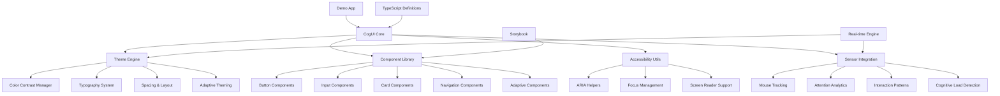
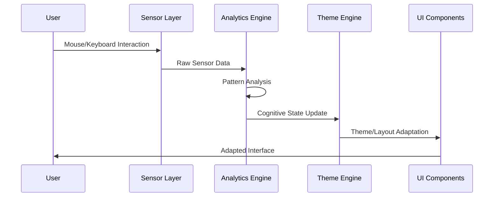

# CogUI - Bilişsel Uyumlu UI Toolkit MVP+ Planı

## 🎯 Proje Vizyonu
CogUI, nöro-çeşitli kullanıcılar için bilişsel yükü azaltan, kişiselleştirilebilir ve erişilebilir UI bileşenleri sunan açık kaynak toolkit'i. MVP+ fazında temel bileşenler, kişiselleştirme özelliklerinin yanı sıra **basit sensör entegrasyonu** da bulunacak.

## 🏗️ Güncellenmiş Teknik Mimari



## 📦 Genişletilmiş Proje Yapısı

```
cogui-toolkit/
├── packages/
│   ├── core/                 # Ana toolkit
│   │   ├── src/
│   │   │   ├── components/   # UI bileşenleri
│   │   │   ├── themes/       # Tema sistemi
│   │   │   ├── sensors/      # Sensör entegrasyon modülleri
│   │   │   ├── adaptive/     # Adaptif davranış sistemi
│   │   │   ├── utils/        # Yardımcı fonksiyonlar
│   │   │   └── types/        # TypeScript tiplemeleri
│   │   └── package.json
│   ├── sensors/              # Bağımsız sensör paketi
│   │   ├── src/
│   │   │   ├── mouse/        # Mouse tracking
│   │   │   ├── attention/    # Dikkat analizi
│   │   │   ├── cognitive/    # Bilişsel yük tespiti
│   │   │   └── analytics/    # Veri analiz modülleri
│   │   └── package.json
│   ├── demo/                 # Demo uygulaması
│   └── storybook/            # Bileşen dokümantasyonu
├── docs/                     # Proje dokümantasyonu
├── tools/                    # Build araçları
└── README.md
```

## 🧠 Sensör Entegrasyonu Özellikleri

### 1. Mouse Tracking & Interaction Analytics
```typescript
interface MouseTrackingData {
  movementPatterns: MovementPattern[];
  clickAccuracy: number;
  hesitationTime: number;
  scrollBehavior: ScrollPattern;
}
```

**Özellikler:**
- Mouse hareketi hızı ve düzensizlikleri
- Click hesitasyonu (kararsızlık) tespiti
- Scroll davranış analizi
- Hover süreleri

### 2. Dikkat ve Odaklanma Analizi
```typescript
interface AttentionMetrics {
  focusTime: number;
  taskSwitchFrequency: number;
  interactionDepth: number;
  cognitiveLoad: 'low' | 'medium' | 'high';
}
```

**Özellikler:**
- Element odaklanma süreleri
- Task switching frequency
- Etkileşim derinlik analizi
- Bilişsel yük tahmini

### 3. Adaptif UI Davranışları
```typescript
interface AdaptiveUIConfig {
  reducedMotion: boolean;
  simplifiedLayout: boolean;
  enhancedContrast: boolean;
  largerTargets: boolean;
  cognitiveAssist: boolean;
}
```

**Otomatik Adaptasyonlar:**
- Yüksek bilişsel yük tespit edildiğinde basitleştirme
- Motor zorluk durumunda target boyutlarını büyütme
- Dikkat dağınıklığında animasyonları azaltma
- Yorgunluk belirtilerinde kontrast artırma

## 🎯 MVP+ Özellikleri Detayı

### Phase 1: Çekirdek Bileşenler
- **Temel UI Komponenları** (Button, Input, Card, Modal, Navigation)
- **Tema Motoru** (renk, typography, spacing)
- **Erişilebilirlik Altyapısı** (WCAG 2.1 AA/AAA)

### Phase 2: Sensör Entegrasyonu
- **Mouse Tracking Modülü**
  - Real-time hareket analizi
  - Click pattern recognition
  - Hesitation detection

- **Attention Analytics**
  - Focus time tracking
  - Element interaction depth
  - Task switching patterns

- **Cognitive Load Detection**
  - Interaction hesitancy analysis
  - Error pattern recognition
  - Performance degradation detection

### Phase 3: Adaptif Sistem
- **Real-time Adaptation Engine**
  - Sensor data → UI adjustments
  - User preference learning
  - Contextual theme switching

- **Smart Personalization**
  - Behavioral pattern recognition
  - Predictive UI adjustments
  - Accessibility auto-configuration

## 🛠️ Genişletilmiş Teknoloji Yığını

### Çekirdek Teknolojiler
- **React 18+** (Hooks, Context API, Concurrent Features)
- **TypeScript** (strict mode + advanced types)
- **CSS-in-JS** (Emotion/Styled Components)
- **Zustand** (state management - minimal ve performant)

### Sensör ve Analytics
- **RxJS** (reactive sensor data streams)
- **D3.js** (veri analizi ve pattern recognition)
- **Web APIs**:
  - `MouseEvent` tracking
  - `PointerEvent` API
  - `IntersectionObserver` (görünürlük tracking)
  - `PerformanceObserver` (performans metrikleri)

### Geliştirme Araçları
- **Storybook** (bileşen geliştirme + sensör simülasyonu)
- **Jest + React Testing Library** (unit testler)
- **Playwright** (e2e testler + sensor simulation)
- **ESLint + Prettier**
- **Husky** (git hooks)

## 📊 Sensör Veri İşleme Akışı



## 🎪 Genişletilmiş Demo Senaryoları

### 1. Adaptif Form Deneyimi
```typescript
// Sensör verilerine göre form adaptasyonu
const AdaptiveForm = () => {
  const { cognitiveLoad, motorDifficulty } = useSensorData();
  
  return (
    <Form
      simplified={cognitiveLoad === 'high'}
      largeTargets={motorDifficulty > 0.7}
      autoValidation={cognitiveLoad === 'low'}
    >
      {/* Form content */}
    </Form>
  );
};
```

### 2. Akıllı Navigation
- Mouse hesitancy tespit edildiğinde menü önerilerini gösterme
- Sık kullanılan öğeleri öne çıkarma
- Karmaşık navigasyonlarda breadcrumb otomatik ekleme

### 3. Bilişsel Destek Modu
- Dikkat dağınıklığında odak yardımcıları
- Görev tamamlama progress indicators
- Cognitive overload warning sistemi

## 🚀 Geliştirme Roadmap (6 hafta)

### Hafta 1-2: Temel Altyapı
- [x] Monorepo kurulumu (Lerna/Nx)
- [ ] TypeScript + React + Storybook
- [ ] Tema motoru altyapısı
- [ ] Temel bileşenler (Button, Input, Card)

### Hafta 3-4: Sensör Entegrasyonu
- [ ] Mouse tracking modülü
- [ ] Attention analytics engine
- [ ] Real-time data processing
- [ ] Sensor data visualization (dev tools)

### Hafta 5-6: Adaptif Sistem & Demo
- [ ] Cognitive load detection
- [ ] Adaptive UI engine
- [ ] Demo uygulaması (showcase)
- [ ] NPM paketi & dokümantasyon

## 🔬 Test ve Validasyon Stratejisi

### Sensör Accuracy Tests
- Controlled environment testing
- A/B testing ile adaptasyon effectiveness
- Performance impact assessment

### Accessibility Compliance
- Automated axe-core testing
- Manual screen reader testing
- Cognitive accessibility validation

### User Experience Validation
- Nöro-çeşitli kullanıcılar ile test sessions
- Cognitive load reduction metrics
- Task completion improvement ölçümleri

## 🎯 Başarı Metrikleri

### Teknik Metrikler
- Bundle size < 50KB (gzipped)
- Sensor processing < 5ms latency
- 99% uptime sensör sistem
- WCAG 2.1 AAA compliance

### User Experience Metrikleri
- %30+ task completion improvement
- %25+ dikkat süresinde artış
- %40+ cognitive load reduction
- %50+ user satisfaction increase

Bu genişletilmiş plan ile CogUI, sadece erişilebilir bir UI toolkit değil, aynı zamanda kullanıcıların bilişsel durumlarını anlayabilen ve buna göre kendini adapte edebilen akıllı bir sistem olacak.